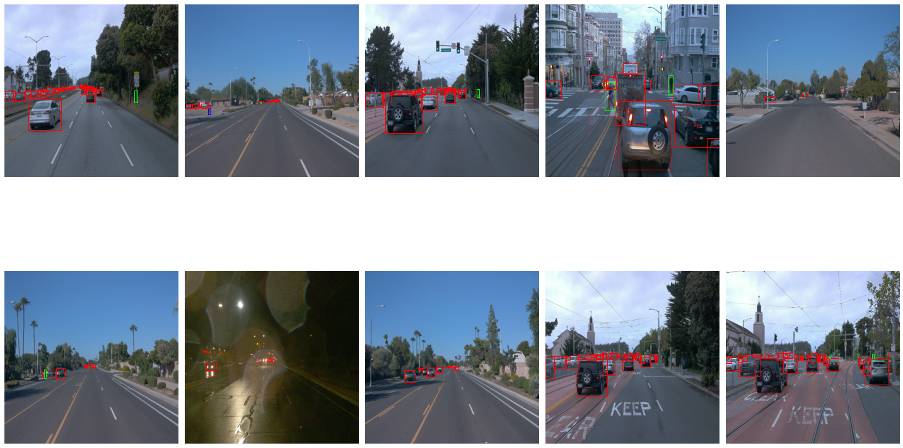
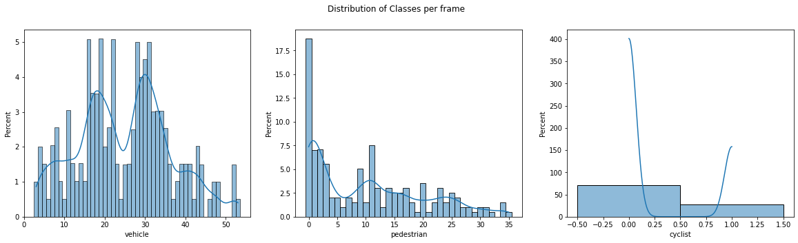
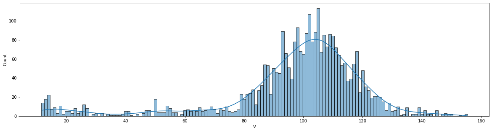
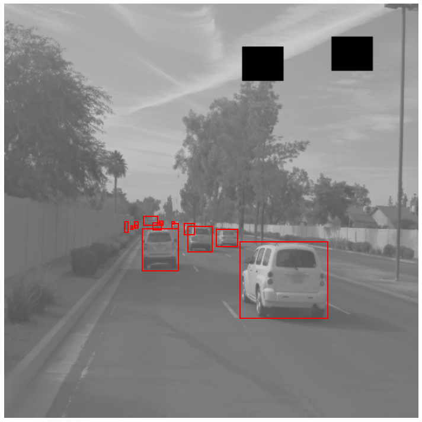
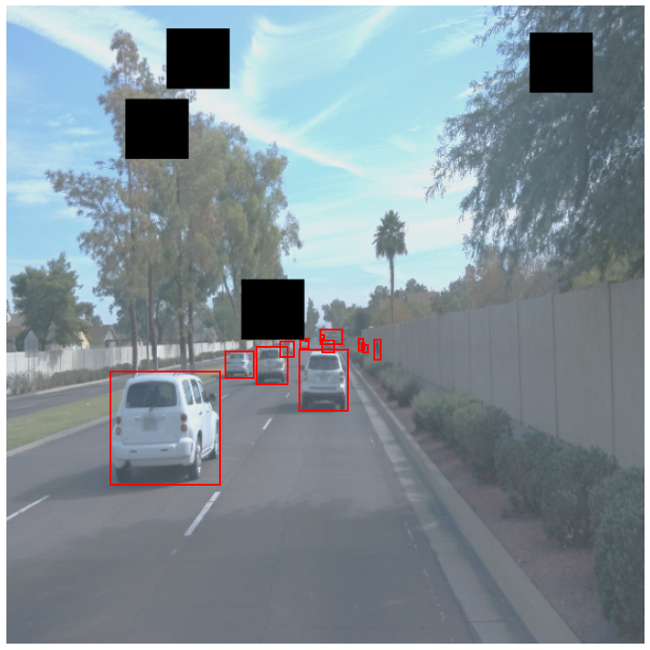
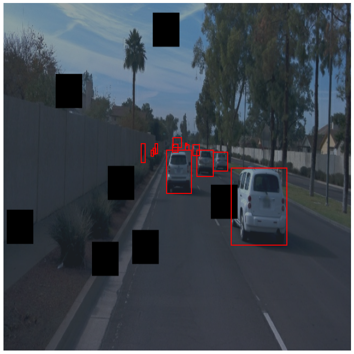
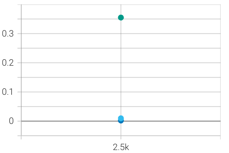
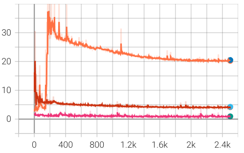
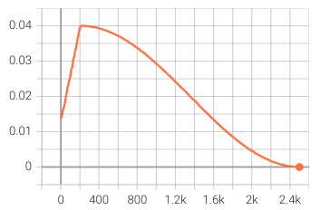
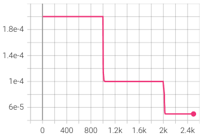

# Object Detection in an Urban Environment

## Table of contents
- [Project overview](#project-overview)
- [Set up](#set-up)
  - [Enviroment](#enviroment)
  - [Directory structure](#directory-structure)
- [Requeriments](#requeriments)
- [Dataset](#dataset)
  - [Dataset analysis](#dataset-analysis)
  - [Cross validation](#cross-validation)
- [Training](#training)
  - [Reference experiment](#reference-experiment)
  - [Improve on the reference](#improve-on-the-reference)


## Project overview
**[...]
This section should contain a brief description of the project and what we are trying to achieve. Why is object detection such an important component of self driving car systems?**

## Set up

### Enviroment
There are two options:
  1. **classroom environment** - all the necessary data and libraries are already available;
  2. **local environment** - follows [README](./build/README.md) to create a docker container and install all prerequisites.

For this project, I used the first option.

### Directory structure
The data for training, validation and testing is organized in the `/home/workspace/data/` directory as follows:

- **train**: contain the training data;
- **val**: contain the validation data;
- **test** - contains the files to test the model and create inference videos.

The `/home/workspace/experiments` folder is organized as follow:

- **pretrained_model**
- **reference** - reference training with the unchanged config file;
- exporter_main_v2.py - to create an inference model;
- model_main_tf2.py - to launch training;
- **experiment0** - first experiment folder;
- **experiment1** - second experiment folder;
- label_map.pbtxt.

## Requeriments

For this project is used the SSD Resnet 50 640x640 model. It is necessary to download the pretrained model and move it to `/home/workspace/experiments/pretrained_model/`. Follow the steps boellow:
```
cd /home/workspace/experiments/pretrained_model/

wget http://download.tensorflow.org/models/object_detection/tf2/20200711/ssd_resnet50_v1_fpn_640x640_coco17_tpu-8.tar.gz

tar -xvzf ssd_resnet50_v1_fpn_640x640_coco17_tpu-8.tar.gz

rm -rf ssd_resnet50_v1_fpn_640x640_coco17_tpu-8.tar.gz
```

## Dataset

### Dataset analysis
Figure 1 shows 10 random images taken from the dataset. It is possible to notice that vehicles are the majority, followed by pedestrians, then cyclists. The analysis of class distribution can be verified in Figure 2, which corroborates with what is shown in the sample 10 images in Figure 1. 

Figure 3 shows the light distribution. In a manual inspection, I noticed that images with V<80 have poor light conditions. In the dataset, the amount of images with poor light conditions is inferior to those with good light conditions (normal sun day).

<figure>

<figcaption align = "center">Figure 1. 10 randomly displayed images. Vehicles are labeled in red, pedestrians in green, and cyclists in blue.</figcaption>
</figure>

### Cross validation
This section should detail the cross validation strategy and justify your approach.

<figure>

<figcaption align = "center">Figure 2. Distribution of classes.</figcaption>
</figure>

<figure>

<figcaption align = "center">Figure 3. Distribution of V (using HSV color model). Notice that, images with lower V have less light.</figcaption>
</figure>

## Training
### Reference experiment
This section should detail the results of the reference experiment. It should includes training metrics and a detailed explanation of the algorithm's performances.

### Improve on the reference
This section should highlight the different strategies you adopted to improve your model. It should contain relevant figures and details of your findings.

<table style="border-style:hidden">
<tr style="border-style:hidden">
  <td style="border-style:hidden">
    
    <figcaption align = "center">Figure 4.1. .</figcaption>
  </td>
  <td>
    
    <figcaption align = "center">Figure 4.2. .</figcaption>
  </td>
</tr>
<tr style="border-style:hidden">
  <td style="border-style:hidden">
    
    <figcaption align = "center">Figure 4.3. .</figcaption>
  </td>
  <td>
    
    <figcaption align = "center">Figure 4.4. .</figcaption>
  </td>
</tr>
<tr style="border-style:hidden">
  <td colspan="2" style="border-style:hidden"><figcaption align = "center">Figure 4. .</figcaption></td>
</tr>
</table>


<table style="border-style:hidden">
<tr style="border-style:hidden">
  <td style="border-style:hidden">
    
    <figcaption align = "center">Figure 5.1. .</figcaption>
  </td>
  <td>
    
    <figcaption align = "center">Figure 5.2. .</figcaption>
  </td>
</tr>
<tr style="border-style:hidden">
  <td style="border-style:hidden">
    
    <figcaption align = "center">Figure 5.3. .</figcaption>
  </td>
  <td>
    
    <figcaption align = "center">Figure 5.4. .</figcaption>
  </td>
</tr>
<tr style="border-style:hidden">
  <td colspan="2" style="border-style:hidden"><figcaption align = "center">Figure 5. .</figcaption></td>
</tr>
</table>